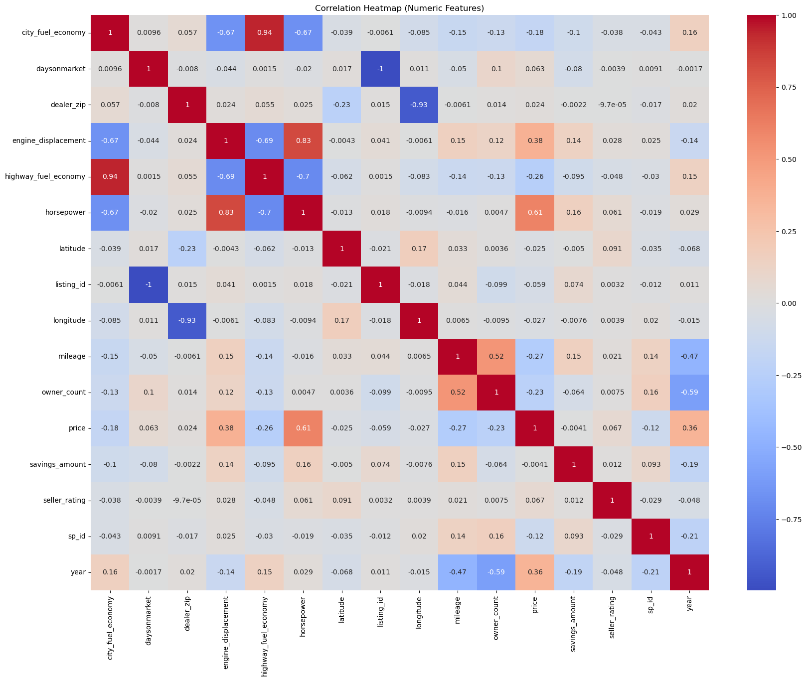
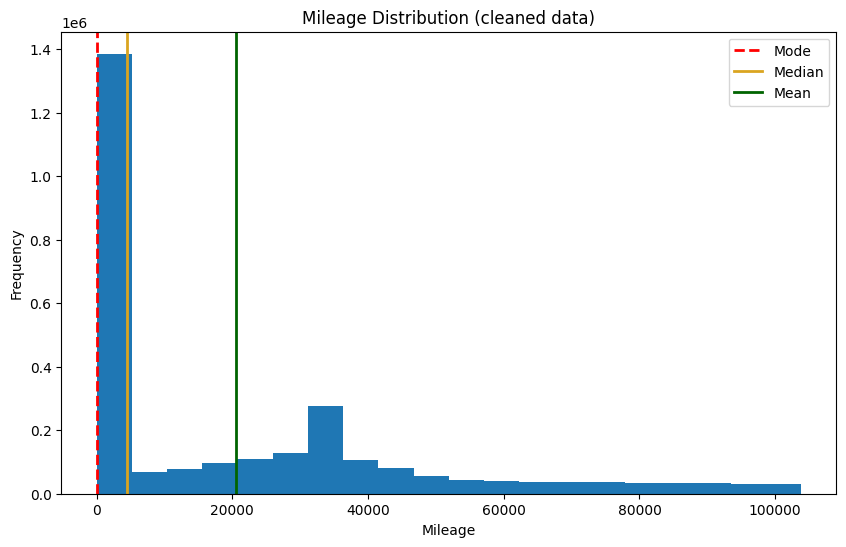
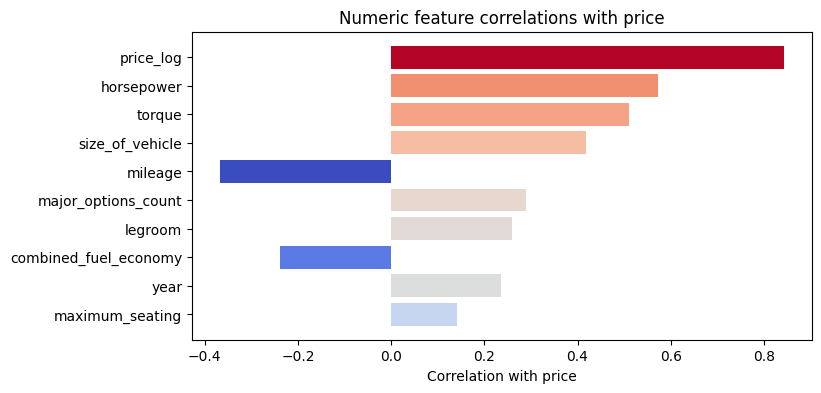
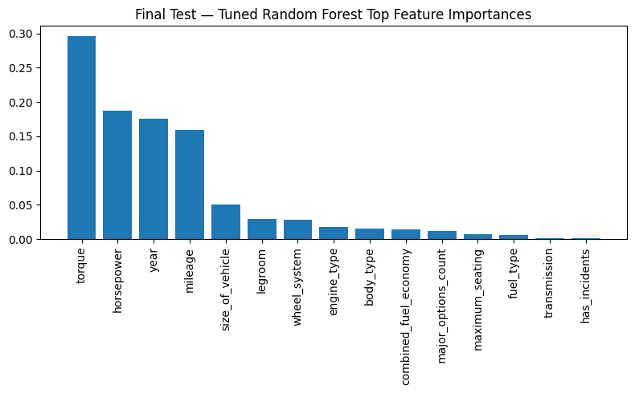
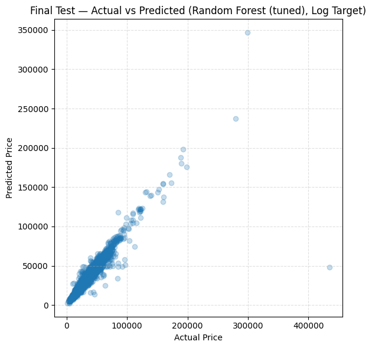
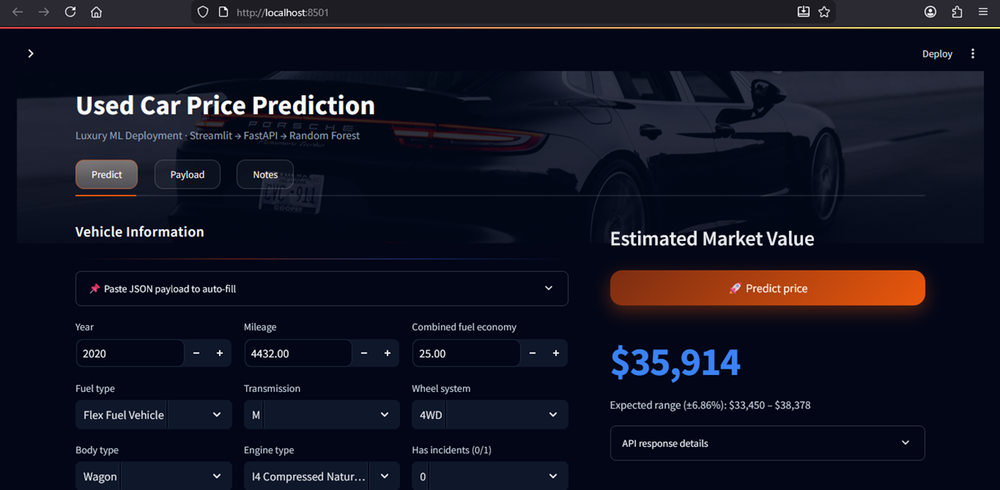
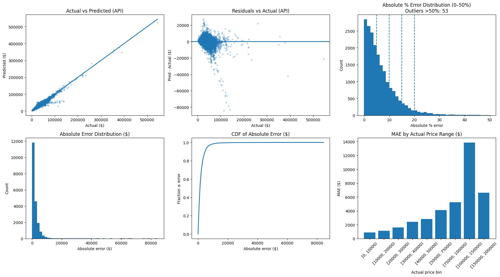

# Used Car Price Prediction Project – Final Report

## Business Understanding

The customer is a used car store chain operating in the USA. They want to use data analytics to support future trading decisions, especially pricing.

The main business problem is inconsistent pricing. If a car is priced too high, it may stay in stock longer and reduce turnover. If it is priced too low, the dealership loses profit. A price prediction model can support staff by giving a consistent estimate based on the car’s features.

Success means

* good prediction accuracy on unseen test data (R², MAE, RMSE)
* clear insights that can support pricing decisions

## Data Understanding

### What data we had

We worked with the US Used Cars dataset with 3,000,040 listings and 66 columns. It includes vehicle attributes such as year, mileage, fuel type, body type, transmission, engine specs (horsepower, engine_displacement), and condition/history flags (has_accidents, salvage, frame_damaged).

### What we checked first

We did an initial scan to understand:

* dataset size and key columns
* duplicates (we found a small number, e.g., 40 duplicate rows)
* missing values, especially in vehicle-specific columns (example: bed fields are missing for most non-trucks)
* messy formats (some measurements stored as strings with units like "59.8 in")

### Key findings from exploration

Two patterns stood out early:

* mileage vs price: higher mileage generally links to lower prices
* year/engine power vs price: newer cars and higher horsepower tend to have higher prices

We also used correlation checks to confirm these relationships. In the correlation heatmap, horsepower showed a clear positive relationship with price, while mileage showed a negative relationship, and year showed a positive relationship.

Figure 1. Correlation heatmap of numeric features, showing strong positive correlation between price and horsepower, and negative correlation between price and mileage.

### Main challenge

The biggest challenge in this phase was the dataset size. Most local laptops struggled with full-data exploration and model experiments. To keep progress moving, we used a 1% subset for early exploration/experiments, then ran the finalized pipeline on the full dataset once everything was stable.

## Data Preparation

In this phase, we converted the raw dataset into a clean and consistent dataset for price modeling.

### What we did

* loaded with Polars (faster for 3M rows) and removed duplicates
* cleaned messy numeric fields where values had units/text (example: "35.1 in", "18 gal") and converted them to floats
* handled missing values with simple rules (mode for categories like transmission/body_type, mean/median for numeric columns)
* created new features to represent cars better:

  * combined_fuel_economy
  * legroom
  * size_of_vehicle
  * major_options_count
  * has_incidents (cleaned boolean)
* removed extreme mileage outliers using the IQR rule to avoid distortion

Figure 2. Mileage distribution after cleaning, used to confirm skew/outliers and support IQR-based outlier handling.

### Why we reduced 66 columns to 17

The raw dataset had many columns that were not suitable for modeling or would not generalize well. We reduced the feature set to a focused group of inputs that are (1) available for most cars, (2) meaningful for pricing, and (3) consistent after cleaning.

We removed fields that were mostly missing (example: truck bed columns), unstructured text (description), IDs/links, and very high-cardinality fields (example: VIN, listing_id, city) that would add noise or make the model harder to deploy. We kept a compact set of features that represent the car’s age, usage, efficiency, size, power, basic categories (fuel/transmission/body/engine/wheel system), incident history, and options.

Figure 3. Numeric feature correlations with price (supports keeping the strongest signals like horsepower/torque/year and removing weaker or irrelevant fields).

### Output of this phase

* final cleaned dataset: 2,743,730 rows with selected modeling features
* a numeric encoded dataset was created for ML, and category mappings were saved for later use (deployment/UI)

### Main challenge

* the biggest challenge was handling the large dataset size while cleaning many inconsistent columns without losing too much data

## Modeling

In this phase, we trained and compared machine learning models to predict used car price. Since price is continuous, this was a regression task.

### Data setup

* input: encoded dataset (selected features from Phase 3)
* split: 80/20 train–test (same test set used for every model)
* scaling: used mainly for linear models and neural networks
* tuning: limited grid search / small CV because of dataset size (retrain on full dataset)

### Models tested

* baselines: Linear Regression, Ridge
* tree/ensemble: Random Forest (default + tuned)
* boosting: LightGBM, XGBoost, CatBoost (default + tuned where possible)
* neural: MLPRegressor (and a small Keras test)

Table 1. Price-target model results (raw price), with tuned vs untuned comparison.

| Model                   | R² (Price) | MAE (Price) | RMSE (Price) | R² (Price) tuned | MAE (Price) tuned | RMSE (Price) tuned |
| ----------------------- | ---------: | ----------: | -----------: | ---------------: | ----------------: | -----------------: |
| Random Forest           |     0.8707 |     2478.66 |      6607.94 |           0.8761 |           2462.82 |            6468.29 |
| LightGBM                |     0.8640 |     3383.00 |      6778.05 |           0.8899 |           2806.33 |            6097.13 |
| XGBoost                 |     0.8724 |     3101.79 |      6563.31 |           0.8598 |           3335.38 |            6881.08 |
| CatBoost                |     0.8485 |     3603.90 |      7151.63 |           0.8805 |           3016.79 |            6351.90 |
| Gradient Boosting       |     0.8336 |     3811.91 |      7495.90 |           0.8030 |           4303.43 |            8156.27 |
| MLP Regressor (sklearn) |     0.7762 |     4299.22 |      8693.29 |           0.7762 |           4299.22 |            8693.29 |
| Keras Deep Learning     |     0.7401 |     4569.04 |      9367.70 |                - |                 - |                  - |
| Ridge                   |          - |           - |            - |           0.5352 |           7007.61 |           12528.33 |
| Linear Regression       |     0.5352 |     7007.77 |     12528.34 |                - |                 - |                  - |

### Evaluation metrics

We compared models using:

* R² (how much variance the model explains)
* MAE ($) (average error in dollars)
* RMSE ($) (penalizes large errors more)

### What we learned

* tree/boosting models clearly outperformed linear models and neural nets for this tabular dataset
* Random Forest and LightGBM were the strongest overall choices
* linear models (R² ~0.54) were too simple for the non-linear relationships in the data

### Target transformation

Raw-price models produced larger errors for expensive cars. To reduce the effect of extreme values and make training more stable, we also trained models using log(price). Final comparisons used the log-target approach, and MAE/RMSE were reported in dollars after converting predictions back.

Table 2. Best five models: price vs log(price) target comparison (errors in USD; log-target predictions back-transformed to dollars).

| Model                   | R² (Price) | MAE (Price) | RMSE (Price) | R² (Log) | MAE (Log) | RMSE (Log) |
| ----------------------- | ---------: | ----------: | -----------: | -------: | --------: | ---------: |
| Random Forest (tuned)   |     0.8761 |     2462.82 |      6468.29 |   0.9456 |   2441.82 |    5823.26 |
| Random Forest (untuned) |     0.8707 |     2478.66 |      6607.94 |   0.9438 |   2444.88 |    5807.27 |
| LightGBM (tuned)        |     0.8899 |     2806.33 |      6097.13 |   0.9421 |   2655.48 |    6095.34 |
| CatBoost (tuned)        |     0.8805 |     3016.79 |      6351.90 |   0.9350 |   2850.10 |    6492.39 |
| XGBoost (untuned)       |     0.8724 |     3101.79 |      6563.31 |   0.9313 |   2968.26 |    6725.43 |

### Main challenge

* training and tuning on a very large dataset required careful sampling and limited tuning runs to stay within compute limits

## Evaluation

In this phase, we checked whether the models meet the project goal: accurate and practical used car price prediction. We compared models on the same test set using R², MAE ($), and RMSE ($), and we also looked at model behavior using residuals and feature importance.

### Model performance (what worked best)

The tuned Random Forest was the strongest overall model when trained on log(price). It reached R² = 0.9456 and produced MAE = 2441.82 and RMSE = 5823.26 (errors reported in dollars after converting predictions back). In practical terms, the model is typically within about $2.4k of the actual price, which is useful for pricing support when the average vehicle price is around the typical used-car range.

Other top models were close behind:

* LightGBM (tuned) achieved R² = 0.9421 with MAE = 2655.48 and RMSE = 6095.34.
* CatBoost (tuned) achieved R² = 0.9350 with MAE = 2850.10 and RMSE = 6492.39.
* XGBoost (untuned) performed strongly with R² = 0.9313 and MAE = 2968.26.
* neural networks and linear models were clearly weaker; linear regression stayed around R² ≈ 0.54 with MAE above $7,000, showing it could not capture the non-linear structure of car pricing.

We also observed that tuning does not automatically guarantee improvement. For example, tuned XGBoost performed worse than its untuned version in our runs, likely because tuning was done under limited computation settings and did not generalize as well.

Table 3. Top models (log(price) target; errors in USD after back-transform).

| Model                 | R² (Log) | MAE (USD) | RMSE (USD) |
| --------------------- | -------: | --------: | ---------: |
| Random Forest (tuned) |   0.9456 |   2441.82 |    5823.26 |
| LightGBM (tuned)      |   0.9421 |   2655.48 |    6095.34 |
| CatBoost (tuned)      |   0.9350 |   2850.10 |    6492.39 |
| XGBoost (untuned)     |   0.9313 |   2968.26 |    6725.43 |
| MLP Regressor         |   0.8870 |   3774.78 |    8664.56 |

### Feature importance (business insights)

Across the best tree-based models, the same drivers repeated as most important:

* horsepower and torque: more powerful cars tend to cost more
* year: newer cars are generally more expensive
* mileage: higher mileage lowers price
* size_of_vehicle and major_options_count had smaller but still noticeable effects

This matches real-world intuition, but the model helped quantify it and confirm that performance, age, and usage dominate the pricing signal.

Figure 4. Random Forest feature importance (top drivers), highlighting horsepower/torque, year, and mileage as the strongest signals.

Note: if the image file name is a typo, keep the figure but rename the file/path consistently (for example, feature_imp_rf.png).

### Residual checks (does the model behave sensibly?)

Residual analysis showed the best models were not strongly biased: predictions were centered around the true values for most cars. Errors increased for very expensive vehicles, which is expected because rare/luxury cars can have pricing factors not fully captured by the available features. These extreme cases were the hardest for every model.

Figure 5. Actual vs predicted prices for the final model, showing a strong diagonal pattern and wider spread for very high prices.

### Final model decision

We selected the tuned Random Forest (log target) for deployment because it had the best overall accuracy and stable performance, while still being straightforward to use and explain compared to more complex alternatives.

## Deployment

In this phase, we deployed the final Random Forest model (trained on log(price)) as a simple service that can be used by non-technical users.

### Deployment approach

We packaged the trained model together with the preprocessing artifacts (feature list and category mappings) and exposed them through a REST API. The API takes a car’s details as JSON and returns a predicted price in dollars (log prediction is converted back to USD).

* backend: FastAPI
* endpoint: /predict
* input: JSON with the same features used in training
* output: predicted_price (USD)

### What we implemented (prototype)

* saved model using joblib (model.joblib)
* saved the exact feature order used by the model (feature_columns.json)
* saved encoding mappings for categorical fields (mappings.json)
* built API endpoints:

  * /health for quick check
  * /codes to show valid category values
  * /predict for price prediction
* created a small UI/web form (or a default JSON template) to make testing easy

Figure 6. Prototype user interface for entering vehicle details and requesting a predicted price.

### Testing (API validation)

We validated deployment by sending 20,000 real rows through the API and comparing predicted vs actual prices. The results showed that:

* the deployed API keeps strong accuracy and behaves consistently with the offline notebook results
* most predictions are close to the true prices (a large majority fall within about ±10–15% error)
* the largest errors mostly happen for very expensive vehicles, where absolute dollar errors naturally grow and rare cases are harder to predict

Figure 7. API validation diagnostics (20,000 tests): actual vs predicted, residual behavior, error distributions, and MAE by price range.

How to read Figure 6 (what it tells us)

* actual vs predicted: points follow the diagonal, meaning the API model is matching real prices well overall
* residuals vs actual: errors are centered near zero for most cars, but spread increases for high-priced cars (expected)
* percent error histogram: most cases are in low error bands, with a small long tail
* MAE by price bin: absolute error increases as prices increase (scale effect)

### Monitoring and maintenance plan

* technical monitoring: API uptime, response time, and error logs
* model monitoring: store predictions and later compare with real sale prices to detect drift
* maintenance: retrain when market changes or when enough new data is collected (for example yearly), and keep model + mappings versioned so updates are reproducible

## Project wrap up

We finished the project by preparing the final report and presentation, and doing a short review session. In that review we explained how the deployed model works, what kind of inputs it needs, where it performs best, and where it can fail (especially rare, very expensive cars).

## Conclusion

This project followed the CRISP-DM process and delivered a complete used-car price prediction solution, from business goal definition to a working deployment prototype.

What we achieved

* built a pricing model that produces reliable predictions for typical vehicles and gives the dealership a repeatable, data-driven reference for pricing decisions
* confirmed the strongest price drivers in our data: year, mileage, and engine power related features, which matches real-world expectation and makes the results easy to trust
* delivered the model as a usable tool (API + simple UI), not just as a notebook result

Main challenges and how we handled them

* dataset size: the full dataset was too heavy for many local machines, so we tested ideas on a smaller subset first and then validated the final pipeline on the full cleaned dataset
* messy raw fields: many columns had units and mixed formats, so cleaning and consistent feature engineering was a big part of the work
* price range extremes: rare high-end vehicles produced the largest errors, so we used log(price) modeling to stabilize learning and reduce the effect of outliers

Business value

* the dealership can use this model to support pricing decisions with a consistent baseline instead of relying only on intuition
* the evaluation and deployment validation show the system performs well in real API use, and most predictions fall within a practical error range for operational pricing
* the feature importance results also act as guidance: cars that are newer, low-mileage, and higher-performance generally justify higher prices, while high mileage and weaker specs reduce value

Future improvements

* add a separate model for sale speed (days on market) to directly support inventory turnover decisions
* add external data (regional trends, seasonality, market indexes) to improve pricing especially for rare or premium vehicles
* set up regular monitoring and scheduled retraining so the model stays accurate as the market changes
