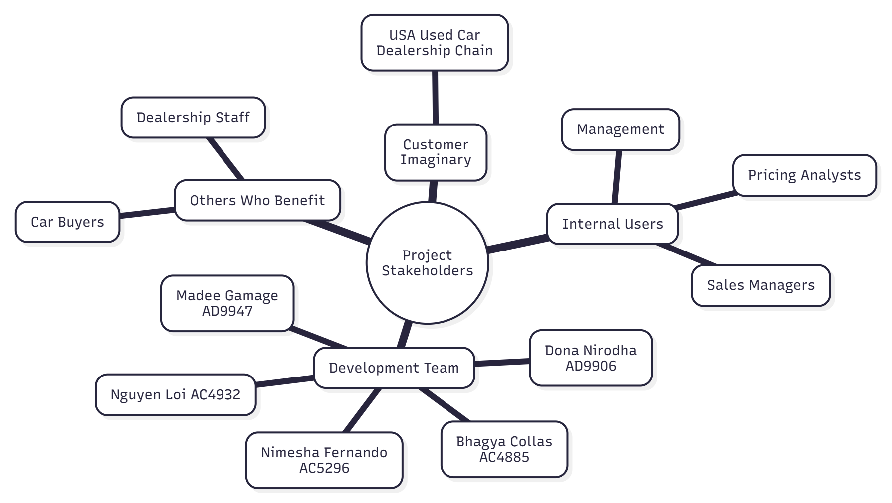
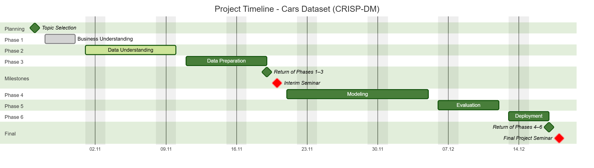

# Phase 1 (Business Understanding)

## 1. Business Objectives

The project supports a used car dealership chain operating across the United States. The company buys, stores, and sells used vehicles of various brands. Their key business objectives include:

- Improve pricing strategy for used cars

- Reduce the number of vehicles stored for long periods

- Increase sales speed and revenue

- Identify popular car types and features that influence pricing and demand

- Use data analytics to support decision making in procurement and sales

The expected outcome is to provide data driven recommendations and predictive models that help the business improve profitability and operational efficiency.

## 2. Current Situation Analysis

The dealership currently relies heavily on human expertise and historical sales knowledge for pricing and inventory decisions. They do not yet utilize advanced data driven analytics or machine learning. Market pricing and customer demand trends change frequently, and without analytical support there is a risk of:

- Overstocking slow-moving vehicles

- Incorrect pricing, leading to lost sales or reduced profit margins

- Limited understanding of evolving buyer preferences and trends

- Inefficient inventory turnover and storage management

The company has historical used car sales data collected during 2020, which can be analyzed to understand the main factors that influence pricing and sale duration.

**Risks and Constraints:**

- The dataset may contain missing or inconsistent entries due to manual recording.

- Market dynamics may have evolved since 2020, so model results may require future recalibration to stay accurate.

## 3. Initial Goals of Data Analysis

The data analysis will seek to answer the following business questions:

- Which features (age, mileage, brand, fuel type, condition, options) most impact price?

- Which car types sell faster?

- Which optional features (navigation, Bluetooth, backup camera) raise price?

- What brand or model segments perform best in the market?

- What pricing patterns exist across vehicle categories?

Planned analysis outputs:

- Descriptive statistics

- Graphical analysis and correlations

- Feature importance insights for price and sale time

## 4. Initial Goals of Modelling

| Task                   | Model Type           | Output                      |
| ---------------------- | -------------------- | --------------------------- |
| Predict used car price | Regression model     | Estimated price             |
| Predict sale time      | Classification model | Class: fast / medium / slow |

Metrics:

- Regression: R², MAE, RMSE

- Classification: Accuracy, F1 Score, confusion matrix

## 5. Project Goals

The final goals of the project are to:

- Build data driven insights for pricing and inventory decisions

- Create predictive models for price and sale time

- Recommend business oriented strategies

- Visualize results for decision-makers

- Deliver documented analysis and final report

Deliverables:

- Cleaned dataset

- Analytics and visualizations

- Machine learning models

- Business insights report and presentation

6. Success Measurements

Project success will be measured based on:

- Accuracy & performance of prediction models

- Insightful visualization and feature importance analysis

- Clear impact on business decisions (pricing and inventory strategy)

- Completion of all CRISP-DM phases and documentation

## 7. Stakeholders and Team (Imaginary Customer)

The imaginary customer is a nationwide used car dealership chain that seeks to improve its pricing strategy and sales efficiency using data analytics and predictive modeling.

**Primary Stakeholder:**

Used car dealership management (business decision makers)

**Others who benefit:**

- Car buyers:
Gain fairer pricing, improved transparency, and better availability of in demand vehicles.

- Dealership staff:
Sales and inventory teams receive decision support tools that help them set competitive prices, identify high demand vehicles, and manage stock efficiently.

## 8. Technologies and Tools

Planned tools and technologies:

- Python (Pandas, NumPy, Scikit-Learn, Seaborn, Matplotlib)

- Jupyter

- Git & GitHub for version control

## 9. Personnel Skills Required

1. Data analysis & cleaning

2. Feature engineering

3. Supervised machine learning (regression/classification)

4. Python programming

5. Data visualization

6. Documentation and presentation

## 10. Project Schedule

The timeline below outlines the planned schedule for completing the CRISP-DM phases:

